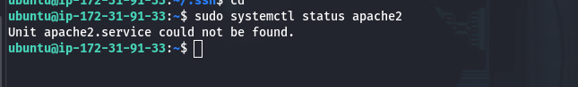

## Hosting Web Servers on different Ansible nodes - Ubuntu and RedHat Linux  - using AMazon EC2

`Spin Up 3 EC2 Instances - Ubuntu(control), Ubuntu(slave node-1) and RedHat(slave node-2)`

`install ansible on control node`

`confirm ansible installation on control node`

`clone website repository to master node`

`add IP addresses of slave nodes to inventory file`

`run a ping test to confirm connection to ansible nodes`

`confirm that apache2 isn't yet installed on the apache-server node`

`confirm that Apache httpd isn't yet installed on redhat-server node`

`write and run a playbook to install apache2 on the ubuntu server node, and apache httpd on the redhat server node`

[installation playbook](./playbooks/install_web_servers.yml)

`Confirm that apache2 and httpd are installed and working`

`write and run a playbook to copy the website files to the ansible nodes`

[copy playbook](./playbooks/copy_web_files.yml)

`confirm web files are in /var/www/html directory on both nodes`

`ubuntu server - files`

`redhat server - files`

`reload servers IP addresses and check for newly-hosted page`

`ubuntu-hosted page`

`redhat-hosted page`

