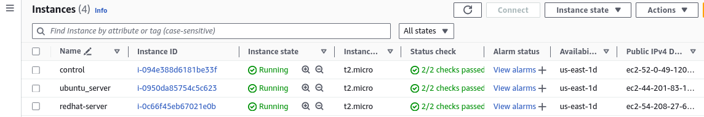
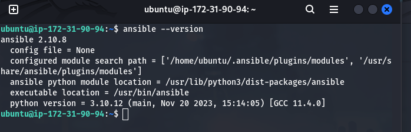

## Hosting Web Servers on different Ansible nodes - UBuntu and RedHat Linux

`Spin Up 3 EC2 Instances - Ubuntu(control), Ubuntu(slave node-1) and RedHat(slave node-2)`

`install ansible on control node`

`confime ansible installation on control node`

2. `change directory using the relative pathname`

3. `create new file with text in specified directory using echo command`

4. `create empty file in the misc directory, then add dummy content.`

5. `Copy contents of fileA into fileC`

6. `Move contents of fileB into fileD`

7. `Create a tar archive called misc.tar for the contents of misc directory`

8. `Compress the tar archive to create a misc.tar.gz file`

9. `Create a user and force the user to change his/her password upon login`

10. `Lock a users password` `unlock user's password to ensure lock worked`

11. `Create a user with no login shell`

12. `Disable password based authentication for ssh`
    

13. `Disable root login for ssh`
